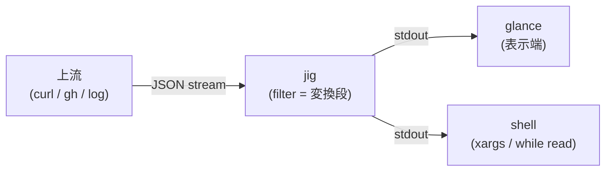
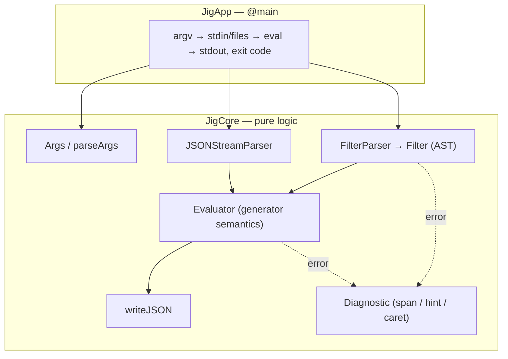

# 用語集 — jig のユビキタス言語

jig を構成する各パーツの **正規の呼び名** をまとめた規範ドキュメント。
**コード・ドキュメント・コミットメッセージ・PR タイトル・Claude Code への
プロンプト、すべてここに載っている名前のみを使う**。同義語は揺らぎを生む。
1 つに決めて、それで通す。

なお **正規名は英語のまま** 保持する。コード識別子・CLI フラグ・環境変数
（`JigValue`, `--raw-output`, `JIG_DEBUG` など）と一対一に対応させるため。
日本語化するのは説明文だけ。

用語が足りなければ、その用語を導入する PR で同時にこのファイルへ追記する。
用語名を変える場合は、コード・ドキュメント・このファイルを **同一 PR で**
書き換える。

> 各エントリの形式: **正規名**, 1〜2 行の定義, 設定 / コードでの所在,
> そして `Don't call it:` 行 — このエントリが置き換える誤った呼び名のリスト。

---

## jig の立ち位置

jig は **pipeline の "変換段"**。jq 互換の filter で JSON を絞り・変形して
次段へ渡す。家族との連携の典型形:

プロセス内の構造（2 層 + データの流れ）:

---

## レイヤー / モジュール

### JigCore
**純ロジック層**。JSON model / parser / writer、filter の parse / 評価、
argv 解析、diagnostics。依存ゼロ・`import Foundation` 禁止
（例外: Log.swift）。XCTest で単体検証できる範囲。
- 場所: [`Sources/JigCore/`](../Sources/JigCore/)
- **Don't call it:** engine module, domain layer, ドメイン層

### JigApp
**実行可能層**。`@main enum JigApp`。stdin/file の読み、stdout/stderr の
書き、exit code 決定。I/O adapter を兼ねる（pure CLI なので AppKit 層は
存在しない）。
- 場所: [`Sources/JigApp/Main.swift`](../Sources/JigApp/Main.swift)
- **Don't call it:** CLI layer, frontend, AdapterMacOS

---

## 言語 / 評価

### filter
jig / jq の**プログラム**。1 つの入力値を出力値の stream に写す関数。
`jig '<filter>' [files...]` の第1位置引数。
- 所在: `Filter` (AST), `parseFilter` — [`Sources/JigCore/Filter.swift`](../Sources/JigCore/Filter.swift)
- **Don't call it:** query, expression, スクリプト, program（CLI 引数の文脈では filter で統一）

### generator semantics
filter の評価モデル: **1 入力 → 0 個以上の出力 stream**。`.[]` は複数を
生み、`,` は stream を連結、`|` は左の各出力を右に流す（flatMap）。
- 所在: `evaluate` — [`Sources/JigCore/Evaluator.swift`](../Sources/JigCore/Evaluator.swift)
- **Don't call it:** lazy evaluation（現実装は eager）, iterator model

### value stream
generator semantics が生む出力列。また入力側も stream — 1 つの stdin/file
は whitespace 区切りの複数 JSON ドキュメントを運べる（NDJSON 含む）。
- 所在: `JSONStreamParser.next()` ループ — [`Sources/JigCore/JSONParser.swift`](../Sources/JigCore/JSONParser.swift)
- **Don't call it:** array of results（stream は array に materialize された値とは別概念）

### optional marker
`?` 後置。型エラーを「空 stream」に変える（`.foo?` `.[]?`）。エラー
メッセージの hint は常にこの形を提案する。
- 所在: `Filter` 各 case の `optional` — [`Sources/JigCore/Filter.swift`](../Sources/JigCore/Filter.swift)
- **Don't call it:** try operator, safe navigation, `?.`

### construction
filter が新しい JSON 値を**組み立てる**構文 — **object construction** `{…}`
と **array construction** `[…]`。object はキー/値の generator を
**カルテシアン積**で展開（entry は左が外側、1 ペア内は key が value より
外側＝ `k as $k | v as $v` 順）、重複キーは last-wins・最初の位置を保持。
array `[f]` は f の value stream を 1 つの array に **materialize** する唯一の
場所で、`.[…]` の index / iterate **suffix** とは別物（前者は値を作り、後者は
値を取り出す）。
- 所在: `Filter.objectConstruct` / `.arrayConstruct` — [`Sources/JigCore/Filter.swift`](../Sources/JigCore/Filter.swift)、`buildObjects` — [`Sources/JigCore/Evaluator.swift`](../Sources/JigCore/Evaluator.swift)
- **Don't call it:** object / array literal（値リテラルではない — 入力に対し評価される filter）, comprehension

---

## データ model

### JigValue
jig の JSON 値 enum。object は**挿入順を保持**する `[(key, value)]`。
JSONSerialization を使わない理由そのもの（key 順序 / literal 保存 /
value 型）。
- 所在: [`Sources/JigCore/JSON.swift`](../Sources/JigCore/JSON.swift)
- **Don't call it:** JSONValue, AnyCodable, dictionary（object の内部表現は ordered pairs）

### literal preservation
number の**原文保持** (jq 1.7 準拠)。入力リテラルは演算が触るまで
`JigNumber.literal` に原文のまま残り、出力にそのまま出る。
`12345678901234567890` が壊れない保証。
- 所在: `JigNumber` — [`Sources/JigCore/JSON.swift`](../Sources/JigCore/JSON.swift)
- **Don't call it:** arbitrary precision（任意精度演算はまだ無い — roadmap）, bignum

---

## 診断

### diagnostic
エラー表示の統一形式: `jig: error: <message>` + program 写し + **caret**
（span 位置の `^`）+ **hint**。compile (`FilterParseError`) と runtime
(`EvalError`) で同一レンダラ。
- 所在: [`Sources/JigCore/Diagnostics.swift`](../Sources/JigCore/Diagnostics.swift)
- **Don't call it:** error message（生文字列のことではない）, stack trace

### span
program ソース内のバイト範囲 `[start, end)`。実行時エラーが「filter の
どこで」起きたかを指せるよう、失敗しうる全 AST node が保持する。
- 所在: `SourceSpan` — [`Sources/JigCore/Filter.swift`](../Sources/JigCore/Filter.swift)
- **Don't call it:** location, position（点ではなく範囲）

### hint
diagnostic の末尾 1 行。「次に何をすべきか」（`?` を付ける、shell quote を
直す、等）。機械的な再掲ではなく、認識できた失敗パターンに固有の助言。
- **Don't call it:** suggestion, note

---

## 互換性

### jq-compat contract
[docs/jq-compat.md](jq-compat.md) の dual-mode 互換性契約。**jq モード**
（既定）は jq 1.7 と観測可能な動作が一致、stdout バイト列と exit code が
契約。破壊的変更は **humane モード** の中だけで、モード差分表に列挙。
診断は両モードとも契約外（改善し放題）、additive 拡張は両モードで使える。
- **Don't call it:** spec, 仕様書（jq manual と混同しない）

### mode (jq mode / humane mode)
jig の 2 つの動作モード。**jq モード**（既定）= jq 1.7 互換。**humane
モード**（`--humane` / `# jig:humane` pragma / `JIG_MODE=humane`）= 意味論の
ワルを意図的に直す opt-in モード。差分は jq-compat.md のモード差分表に全列挙。
- **Don't call it:** strict mode（humane は厳密化ではなく「より寛容/直感的」）, --debug（無関係）

### conformance suite
jqlang/jq の `tests/jq.test` を golden test 化して通過率を計測する計画
（roadmap）。互換の証明はこれで行い、口頭の「ほぼ互換」を数字にする。
- **Don't call it:** unit tests（JigCoreTests とは別物）

---

## 運用

### JIG_DEBUG
verbose trace の**唯一の**トリガ（環境変数）。set 時のみ stderr +
`/tmp/jig.log` に trace。`--debug` flag は存在しない（家風）。quiet path は
余分 I/O ゼロ。
- 所在: `debugMode` / `Log` — [`Sources/JigCore/Log.swift`](../Sources/JigCore/Log.swift)
- **Don't call it:** --debug, verbose mode flag

### rolling draft release
push to main ごとに git-cliff が次 version を計算し、**単一の draft**
GitHub Release を作成/更新する家風のリリースモデル。tag は人間が Publish
した瞬間に GitHub が作る。
- 所在: [`.github/workflows/release.yml`](../.github/workflows/release.yml), [`cliff.toml`](../cliff.toml)
- **Don't call it:** auto release（publish は常に手動）, nightly
