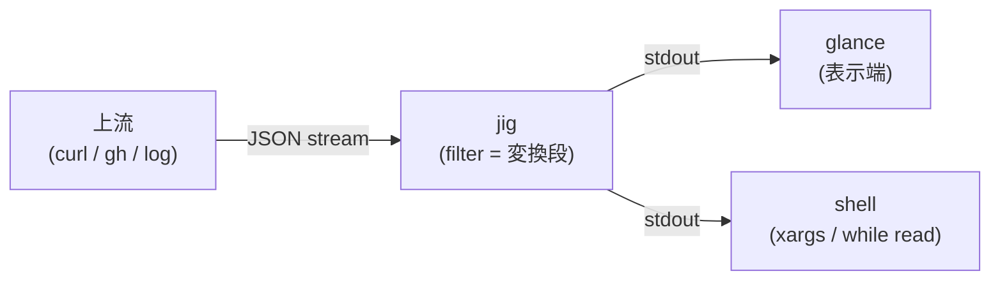
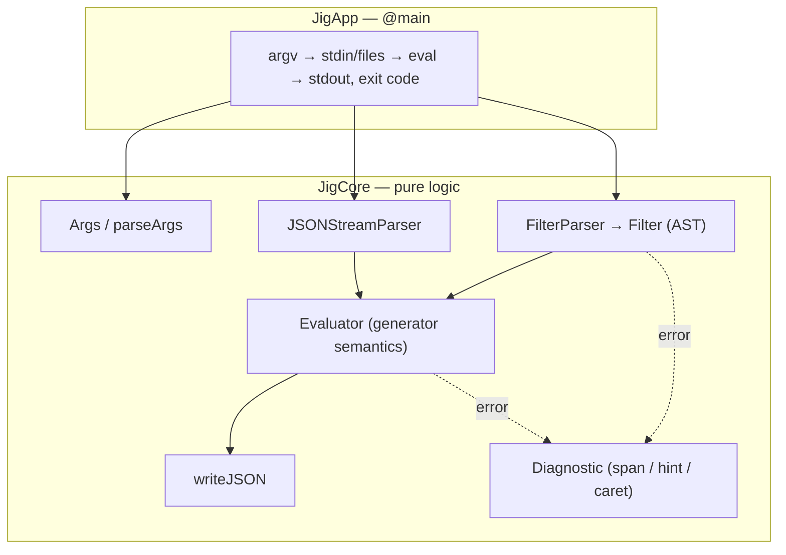

# 用語集 — jig のユビキタス言語

jig を構成する各パーツの **正規の呼び名** をまとめた規範ドキュメント。
**コード・ドキュメント・コミットメッセージ・PR タイトル・Claude Code への
プロンプト、すべてここに載っている名前のみを使う**。同義語は揺らぎを生む。
1 つに決めて、それで通す。

なお **正規名は英語のまま** 保持する。コード識別子・CLI フラグ・環境変数
（`JigValue`, `--raw-output`, `JIG_DEBUG` など）と一対一に対応させるため。
日本語化するのは説明文だけ。

用語が足りなければ、その用語を導入する PR で同時にこのファイルへ追記する。
用語名を変える場合は、コード・ドキュメント・このファイルを **同一 PR で**
書き換える。

> 各エントリの形式: **正規名**, 1〜2 行の定義, 設定 / コードでの所在,
> そして `Don't call it:` 行 — このエントリが置き換える誤った呼び名のリスト。

---

## jig の立ち位置

jig は **pipeline の "変換段"**。jq 互換の filter で JSON を絞り・変形して
次段へ渡す。家族との連携の典型形:

プロセス内の構造（2 層 + データの流れ）:

---

## レイヤー / モジュール

### JigCore
**純ロジック層**。JSON model / parser / writer、filter の parse / 評価、
argv 解析、diagnostics。依存ゼロ・`import Foundation` 禁止
（例外: Log.swift）。XCTest で単体検証できる範囲。
- 場所: [`Sources/JigCore/`](../Sources/JigCore/)
- **Don't call it:** engine module, domain layer, ドメイン層

### JigApp
**実行可能層**。`@main enum JigApp`。stdin/file の読み、stdout/stderr の
書き、exit code 決定。I/O adapter を兼ねる（pure CLI なので AppKit 層は
存在しない）。
- 場所: [`Sources/JigApp/Main.swift`](../Sources/JigApp/Main.swift)
- **Don't call it:** CLI layer, frontend, AdapterMacOS

---

## 言語 / 評価

### filter
jig / jq の**プログラム**。1 つの入力値を出力値の stream に写す関数。
`jig '<filter>' [files...]` の第1位置引数。
- 所在: `Filter` (AST), `parseFilter` — [`Sources/JigCore/Filter.swift`](../Sources/JigCore/Filter.swift)
- **Don't call it:** query, expression, スクリプト, program（CLI 引数の文脈では filter で統一）

### generator semantics
filter の評価モデル: **1 入力 → 0 個以上の出力 stream**。`.[]` は複数を
生み、`,` は stream を連結、`|` は左の各出力を右に流す（flatMap）。
- 所在: `evaluate` — [`Sources/JigCore/Evaluator.swift`](../Sources/JigCore/Evaluator.swift)
- **Don't call it:** lazy evaluation（現実装は eager）, iterator model

### value stream
generator semantics が生む出力列。また入力側も stream — 1 つの stdin/file
は whitespace 区切りの複数 JSON ドキュメントを運べる（NDJSON 含む）。
- 所在: `JSONStreamParser.next()` ループ — [`Sources/JigCore/JSONParser.swift`](../Sources/JigCore/JSONParser.swift)
- **Don't call it:** array of results（stream は array に materialize された値とは別概念）

### optional marker
`?` 後置。型エラーを「空 stream」に変える（`.foo?` `.[]?`）。エラー
メッセージの hint は常にこの形を提案する。
- 所在: `Filter` 各 case の `optional` — [`Sources/JigCore/Filter.swift`](../Sources/JigCore/Filter.swift)
- **Don't call it:** try operator, safe navigation, `?.`

### construction
filter が新しい JSON 値を**組み立てる**構文 — **object construction** `{…}`
と **array construction** `[…]`。object はキー/値の generator を
**カルテシアン積**で展開（entry は左が外側、1 ペア内は key が value より
外側＝ `k as $k | v as $v` 順）、重複キーは last-wins・最初の位置を保持。
array `[f]` は f の value stream を 1 つの array に **materialize** する唯一の
場所で、`.[…]` の index / iterate **suffix** とは別物（前者は値を作り、後者は
値を取り出す）。
- 所在: `Filter.objectConstruct` / `.arrayConstruct` — [`Sources/JigCore/Filter.swift`](../Sources/JigCore/Filter.swift)、`buildObjects` — [`Sources/JigCore/Evaluator.swift`](../Sources/JigCore/Evaluator.swift)
- **Don't call it:** object / array literal（値リテラルではない — 入力に対し評価される filter）, comprehension

### string interpolation
`"a\(f)b"` — literal 断片に、埋め込み filter `f`（full pipe）の出力を
**coerce**（jq の `tostring`: string はそのまま、他は compact JSON）して
差し込む構文。複数補間は **最右が最も外側** のカルテシアン積、`\(empty)` は
全体を空にする。`${f}` は同義の **additive な ECMAScript エイリアス**
（同じ `StringPart` 列にパースされる）。補間の無い `"…"` は素の `literal`。
- 所在: `Filter.stringInterp` / `StringPart` — [`Sources/JigCore/Filter.swift`](../Sources/JigCore/Filter.swift)、`interpolate` — [`Sources/JigCore/Evaluator.swift`](../Sources/JigCore/Evaluator.swift)
- **Don't call it:** template string（JS 等価の説明では template literal と呼ぶが、jig の正規名は string interpolation）, format string（`@base64` 等の `@fmt "…"` は別物 — roadmap step 6）

---

## builtin（Wave1 合成セット）

> 正典名は es-toolkit / JS 綴り。jq 名と**形が違う**ものは alias しない（混同を
> 防ぐ）。設計の根拠は [principles.md](principles.md)（§2 小さく重ねる・§5 診断）。

### slice
`.[a:b]` — 配列/文字列の部分列。両端 optional（`.[a:]` `.[:b]` `.[:]`）、負
index は末尾から、範囲外は clamp、`low >= high` は空。文字列は **Unicode scalar**
単位（`length` と一貫）。`.index`（配列のみ）・`.iterate` `.[]` とは別 suffix。
- 所在: `Filter.slice` — [`Sources/JigCore/Filter.swift`](../Sources/JigCore/Filter.swift)、eval — [`Sources/JigCore/Evaluator.swift`](../Sources/JigCore/Evaluator.swift)、parse は `parseSuffix` の `[` 分岐 — [`Sources/JigCore/FilterParser.swift`](../Sources/JigCore/FilterParser.swift)
- **Don't call it:** substring / substr（文字列専用ではない）, `.[a:b:c]`（step 付きスライスは無い）

### range
`range(n)` / `range(from; to[; step])` — 有限の数値 **stream**（generator）。
位置別スカラ引数なので `;` 区切り（`,` は別物＝ストリーム）。jig の評価器は eager
なので**上限ガード**（1000 万件）付き＝OOM を humane エラーに。真の遅延 range は
roadmap §5(12)。
- 所在: `rangeValues` — [`Sources/JigCore/Builtins.swift`](../Sources/JigCore/Builtins.swift)
- **Don't call it:** lodash `range`（配列を返す。jig は stream）, 無限 range（今は有限のみ）

### groupBy
配列を**キー式ごとに分類**し `{key: [items…]}` を返す（人が欲しい形）。キーは
f の **第1出力**を tostring 強制（string はそのまま・number/bool は compact JSON・
null/array/object はエラー）。キーは初出順。
- 所在: `groupByOf` — [`Sources/JigCore/Builtins.swift`](../Sources/JigCore/Builtins.swift)
- **Don't call it:** `group_by`（jq の配列の配列 `[[…],[…]]` ＝**別形・非 alias**）, classify

### mapValues
object の各**値** / 配列の各**要素**に f を適用（キー/順序は保持）、f の第1出力で
置換。**空出力は entry を落とす**（jq `.[] |= f` 整合）。`map_values` は受理 alias。
`groupBy(f) | mapValues(length)` ＝ `countBy(f)`。
- 所在: `mapValuesOf` — [`Sources/JigCore/Builtins.swift`](../Sources/JigCore/Builtins.swift)
- **Don't call it:** `map`（array と object で挙動が違う・`map` は `[.[]|f]`）

### orderBy
配列を**キーでソート**。`orderBy(.a, .b)` は comma が**キー組**（ストリームのまま＝
[principles.md](principles.md) §1）、`jqCompare` 全順序で **index tie-break の安定
ソート**。**降順は `| reverse`**（方向引数を作らない＝§2）。`orderBy(.x, "desc")` の
文字列リテラルは罠 → 診断で拾う（§5）。
- 所在: `orderByOf` / `stringLiteralKey` — [`Sources/JigCore/Builtins.swift`](../Sources/JigCore/Builtins.swift)
- **Don't call it:** sort / sortBy / `sort_by`（正典は `orderBy`・alias は Wave2）, `orderBy(f, "desc")`（方向引数は無い）

### toPairs / fromPairs
object ⇄ `[[key, value], …]`（JS `Object.entries` / `Object.fromEntries`）。
`fromPairs` は 2 要素配列・string キー必須、重複は後勝ち（初出位置保持）。
- 所在: `toPairsOf` / `fromPairsOf` — [`Sources/JigCore/Builtins.swift`](../Sources/JigCore/Builtins.swift)
- **Don't call it:** `to_entries` / `from_entries`（jq の `[{key,value}]` ＝**別形・非 alias**）, entries

---

## データ model

### JigValue
jig の JSON 値 enum。object は**挿入順を保持**する `[(key, value)]`。
JSONSerialization を使わない理由そのもの（key 順序 / literal 保存 /
value 型）。
- 所在: [`Sources/JigCore/JSON.swift`](../Sources/JigCore/JSON.swift)
- **Don't call it:** JSONValue, AnyCodable, dictionary（object の内部表現は ordered pairs）

### literal preservation
number の**原文保持** (jq 1.7 準拠)。入力リテラルは演算が触るまで
`JigNumber.literal` に原文のまま残り、出力にそのまま出る。
`12345678901234567890` が壊れない保証。
- 所在: `JigNumber` — [`Sources/JigCore/JSON.swift`](../Sources/JigCore/JSON.swift)
- **Don't call it:** arbitrary precision（任意精度演算はまだ無い — roadmap）, bignum

---

## 診断

### diagnostic
エラー表示の統一形式: `jig: error: <message>` + program 写し + **caret**
（span 位置の `^`）+ **hint**。compile (`FilterParseError`) と runtime
(`EvalError`) で同一レンダラ。
- 所在: [`Sources/JigCore/Diagnostics.swift`](../Sources/JigCore/Diagnostics.swift)
- **Don't call it:** error message（生文字列のことではない）, stack trace

### span
program ソース内のバイト範囲 `[start, end)`。実行時エラーが「filter の
どこで」起きたかを指せるよう、失敗しうる全 AST node が保持する。
- 所在: `SourceSpan` — [`Sources/JigCore/Filter.swift`](../Sources/JigCore/Filter.swift)
- **Don't call it:** location, position（点ではなく範囲）

### hint
diagnostic の末尾 1 行。「次に何をすべきか」（`?` を付ける、shell quote を
直す、等）。機械的な再掲ではなく、認識できた失敗パターンに固有の助言。
- **Don't call it:** suggestion, note

---

## 意味論・歴史

### one semantics（モードは一つ）
jig は単一の意味論を持つ。**dual-mode（jq モード / humane モード）は撤去済み**
（2026-06-13）— `--humane` flag・`# jig:humane` pragma・`JIG_MODE` env・
`Sources/JigCore/Mode.swift` は削除。`.[]` を null に適用 → 空ストリーム、
`//` は false+null を落とす、`??` は nullish（null のみ落とす）。`//` と `??`
は意図的に別物。方向性の正本は [docs/roadmap.md](roadmap.md)。
- **Don't call it:** jq モード, humane モード（どちらも存在しない）, strict mode

### jq-compat contract（SUPERSEDED / 歴史的用語）
かつての dual-mode 互換性契約（[docs/jq-compat.md](jq-compat.md)）。jig は
jq 互換を追わなくなったため**無効**。jq-compat.md は歴史的参考としてのみ残す。
- **Don't call it:** 現行仕様（jig の意味論は one semantics）, spec

### golden（jig 自身の仕様への golden test）
テストは「jq とバイト一致」ではなく **jig 自身の仕様への golden**（roadmap §1）。
期待値は歴史的に jq 1.8 と相互チェックしたが、オラクルは jig の仕様であって
jq ではない。jq の `tests/jq.test` 準拠を目標にしていた旧 conformance-suite
計画は撤去。
- **Don't call it:** jq conformance（互換の証明はもう目標でない）, unit tests（JigCoreTests とは別物）

---

## 運用

### JIG_DEBUG
verbose trace の**唯一の**トリガ（環境変数）。set 時のみ stderr +
`/tmp/jig.log` に trace。`--debug` flag は存在しない（家風）。quiet path は
余分 I/O ゼロ。
- 所在: `debugMode` / `Log` — [`Sources/JigCore/Log.swift`](../Sources/JigCore/Log.swift)
- **Don't call it:** --debug, verbose mode flag

### rolling draft release
push to main ごとに git-cliff が次 version を計算し、**単一の draft**
GitHub Release を作成/更新する家風のリリースモデル。tag は人間が Publish
した瞬間に GitHub が作る。
- 所在: [`.github/workflows/release.yml`](../.github/workflows/release.yml), [`cliff.toml`](../cliff.toml)
- **Don't call it:** auto release（publish は常に手動）, nightly
